https://github.com/narumincho/definy に統合予定

# ナルミンチョの創作記録

## 構成図



## 開発方法

Node.js が必要になるので, インストールします.

リポジトリをクローンした場所で

```ps1
npm i
```

を実行すると, 必要な npm パッケージがインストールされ,

```ps1
npm run build
```

を実行し, ビルドしたあと

```ps1
npm run start-emulator
```

で, Firebase の エミュレータを起動できます.
